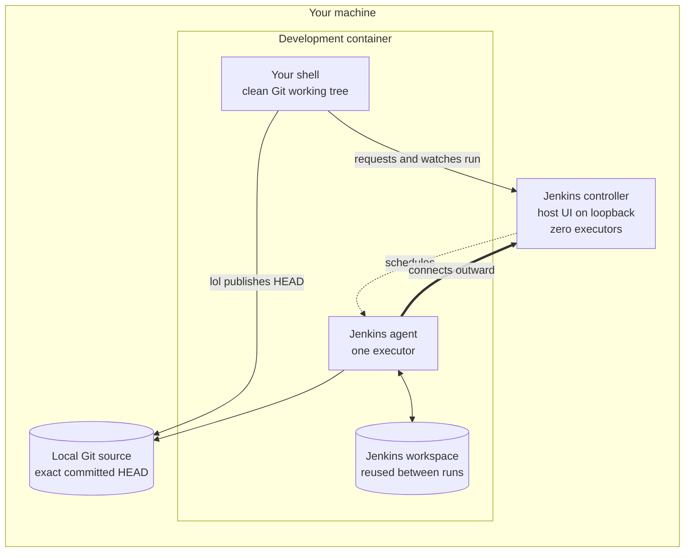
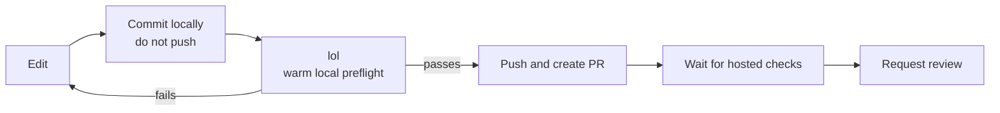

# lol

Launch Our Logic — run your repository's own pipeline on your own machine
before it runs anywhere else.

`lol` is intended to take the `Jenkinsfile` already committed to a repository
and run it through a local Jenkins controller using the same development
environment in which the code was written. The first milestone is deliberately
small: prove one complete, warm local pipeline run before adding clean-room
execution or broader isolation.

**This repository currently contains a design, not an implementation.** The
prototype can begin once `jenkins-controller` and the development-environment
tooling publish the small command contracts required by the warm path.

## Why local first

A repository-owned `Jenkinsfile` describes how a project builds and tests
itself, but it is normally exercised only after a push. That puts a network
round trip, a queue, and shared infrastructure between a developer and the
answer to "does my pipeline work?"

`lol` is meant to close that loop locally:

- The repository's committed `Jenkinsfile` remains the pipeline definition.
- The exact local commit is tested without first pushing it to GitHub.
- The run uses the existing development environment and can reuse its build
  state.
- The command waits for Jenkins, streams the build output, and returns the
  pipeline result to the caller.

Hosted CI remains the authority for merging. A successful `lol` run is a local
preflight, not a substitute for hosted checks or review.

## v0.1: prove the warm path

The prototype has one job: run the current repository's committed `HEAD` on a
long-lived local Jenkins agent and report whether the pipeline passed.

A v0.1 run will:

1. Confirm that the current directory belongs to a Git repository with a
   committed `Jenkinsfile`.
2. Refuse to run if the working tree contains staged, unstaged, or untracked
   changes.
3. Record and display the repository and exact `HEAD` commit SHA.
4. Make that commit available to Jenkins through local Git transport, without
   pushing it to a remote.
5. Start a pipeline run, wait for it, and stream its console output.
6. Exit successfully only when the Jenkins run succeeds.

The Jenkins workspace will be separate from the developer's working tree. The
agent will keep that workspace between runs so the build system can reuse
previous outputs and caches where it is safe to do so. The agent will have one
executor, which prevents two builds from writing to the same incremental state
concurrently.

## Prototype architecture

The development-environment tooling will own the infrastructure lifecycle. It
will start the local controller and connect the persistent agent when the
development environment starts. `lol` will not receive a Podman socket or
create or destroy containers.



The controller's host-facing UI and API will be bound to loopback, and the
development-environment tooling will give the agent a private path to the
controller. The controller will perform no builds of its own. The agent will
connect outward to it and run the repository pipeline in the development
container. Jenkins will check out the locally published commit into its own
workspace; it will never run against the interactive working tree.

## Initial Jenkinsfile contract

v0.1 targets a deliberately narrow pipeline surface:

- Linux build and test stages that run on the prototype agent label.
- Normal Jenkins SCM checkout, including `checkout scm`.
- Shell-based tools already provided by the development image.
- One pipeline run at a time.

Production credentials, shared Jenkins libraries, dynamically created
container agents, specialized plugins, submodule handling, and arbitrary agent
topologies are outside the prototype contract. Support can be added after the
basic loop has been proven.

## First real repository: dev-tools

[`thelarklan/dev-tools`](https://github.com/thelarklan/dev-tools) will be the
first real repository used to prove v0.1 once the required controller and
development-environment support is ready.

Its existing `Jenkinsfile` is the acceptance test. `lol` must run that file
unchanged, honor its `linux` agent requirement and `checkout scm`, and report
the result of its ShellCheck and shell test suite. The prototype does not pass
acceptance if dev-tools needs a second pipeline definition or changes made only
to accommodate `lol`.

Before that real-repository check, a small fixture pipeline may be used to
prove controller connectivity, agent scheduling, local checkout, log
streaming, and exit-code propagation.

## Git and pull-request workflow

`lol` verifies a local commit; it does not push branches, create pull requests,
post comments, or change review state. Those responsibilities remain in
[`dev-tools`](https://github.com/thelarklan/dev-tools) and the hosted GitHub
workflow.



The current `pr-commit` helper pushes as part of its workflow, so it is not the
pre-`lol` commit step unless it later gains a no-push mode. Until then, create
the local commit with Git, run `lol`, and use the dev-tools helpers after the
local preflight passes.

## Planned command surface

The prototype keeps the common case to one word:

```bash
lol          # run committed HEAD and wait for the result
lol status   # report controller, agent, and last-run status
lol doctor   # explain missing or unhealthy prerequisites
```

`lol` should produce actionable errors for a missing `Jenkinsfile`, a dirty
working tree, an unavailable controller, an offline agent, an unsupported
pipeline requirement, or a failed Jenkins run.

These commands are the proposed v0.1 interface. They are not implemented yet.

## Prototype trust boundary

The first prototype is for repositories and Jenkinsfiles that the developer
trusts. Pipeline code runs inside the development container and therefore
shares its trust boundary. It may be able to reach developer credentials,
including GitHub tokens or SSH keys, even though the pipeline does not require
them.

The build is not given the Podman socket, and the controller remains local, but
v0.1 is not a sandbox for untrusted pull requests. Do not use it to execute
unreviewed pipeline code from an untrusted source.

## Roadmap after v0.1

Once dev-tools passes through the warm path unchanged, later milestones can
add:

1. `lol --clean`, using a fresh agent container with an empty workspace and no
   reused build state.
2. A credential-free sibling agent with isolated storage and restricted
   networking for stronger pipeline isolation.
3. Namespaced caches, concurrency controls, cleanup, and wider Jenkinsfile and
   plugin compatibility.
4. A Codex skill that coordinates local commits, `lol`, dev-tools, hosted
   checks, and review readiness without coupling those responsibilities into
   the `lol` command itself.

Clean local runs will still be preflight checks. Hosted CI and maintainer
review remain the final authority for merge decisions.

## Status

Not implemented. This repository currently records the v0.1 contract and the
later roadmap.

Implementation can begin when:

- `jenkins-controller` can provide a loopback-bound, zero-executor controller
  and report its readiness;
- the development-environment tooling can start one persistent `linux` agent
  with a separate, reusable workspace; and
- the controller and agent can both access an exact local Git commit through a
  documented local source contract.

The first completion milestone is an unchanged dev-tools Jenkinsfile passing
through `lol` at a displayed local commit SHA, with logs streamed to the caller
and no GitHub push required.

## License

MIT
