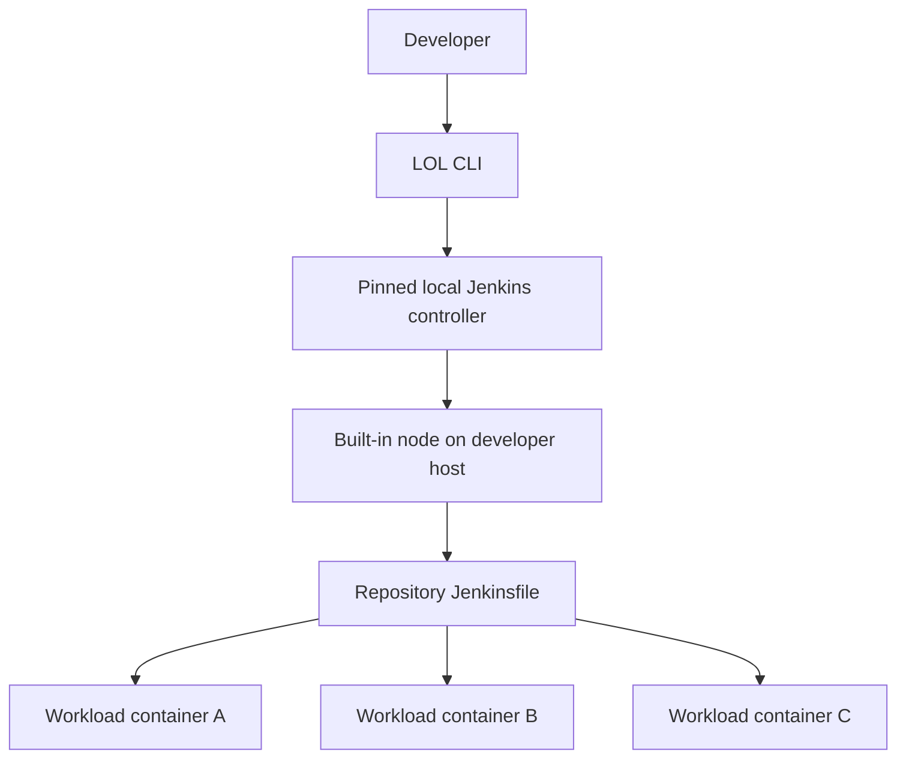

# LOL — Launch on Local

LOL is a local Jenkins harness for running a repository's real `Jenkinsfile` on a developer workstation.

It creates an isolated, reproducible Jenkins controller, uses the controller's built-in node to execute the pipeline on the host, and leaves workload orchestration to the repository. If the pipeline normally launches several rootless Podman containers in parallel, it can do the same locally.

> **Project status:** v0.1 release candidate. The complete command surface is executable and the
> required acceptance job runs declarative, scripted, parameterized, credentialed, artifact, result,
> restart/reset, dirty-snapshot, and parallel rootless-Podman fixtures against the pinned Jenkins LTS.

## Why LOL?

Jenkins pipelines are often difficult to exercise before pushing a change to a shared controller. The Jenkinsfile, plugins, node labels, controller configuration, and host tools all affect whether a pipeline works.

LOL makes that environment disposable and repeatable:

- The repository provides its Jenkinsfile and LOL configuration.
- LOL provides a pinned local Jenkins controller and job.
- Jenkins executes on the developer's host through its built-in node.
- The Jenkinsfile continues to own its build, test, and container behavior.



## Installation

LOL requires Python 3.11 or newer. The recommended installation uses
[pipx](https://pipx.pypa.io/stable/installation/) so the command and Python dependencies remain
isolated. Until the first release is published, install a checkout or its built wheel:

```bash
pipx install .
# or: pipx install dist/launch_on_local-*.whl
lol --version
```

An ordinary virtual environment is the supported fallback:

```bash
python3 -m venv .venv
.venv/bin/pip install .
.venv/bin/lol --version
```

## Inspect configuration

Place a schema-v1 `lol.yaml` in a Git repository, then inspect the validated, merged,
non-secret configuration:

```bash
lol config show
lol --format json config show
```

Precedence is built-in defaults, repository `lol.yaml`, user configuration under
`$XDG_CONFIG_HOME/lol/config.yaml`, and explicit CLI overrides. Secret-like keys are redacted.
The output's `lock_inputs` section identifies `jenkins.version` and `jenkins.plugins` as committed,
repository-owned inputs. User or command-line values for those keys may appear in the effective
configuration, but they do not change artifact resolution or the committed plugin lock.

## Pin Jenkins and plugins

Resolve the repository's requested plugins against the Jenkins release selected by `lol.yaml`:

```bash
lol lock --yes
git add lol.plugins.lock.yaml
```

`pinned-lts` resolves to the exact Jenkins LTS tested by the installed LOL release. LOL downloads
that checksum-pinned WAR and the checksum-pinned official Jenkins Plugin Installation Manager,
resolves the complete plugin dependency graph with upgrades disabled, hashes every resolved plugin,
and writes a deterministic `lol.plugins.lock.yaml`. Existing locks are previewed as a unified diff
before replacement unless `--yes` is supplied.

Cached inputs live below `$XDG_CACHE_HOME/lol` (or `~/.cache/lol`) and are reused only after their
SHA-256 digest is verified. Later controller commands consume only the URLs, versions, and hashes in
the committed lock; they do not resolve plugin versions implicitly.

Use the read-only check in CI or before starting a controller:

```bash
lol lock --check
```

The check validates the packaged lock schema, release-owned artifact coordinates, canonical Jenkins
and plugin URLs, sorted unique plugin IDs, requested-plugin markers, and the digest of the
repository-owned Jenkins contract. User-level overrides never change committed lock inputs. The
check performs no network access and fails if the lock is missing or stale.

## Quick start

### Prerequisites

- Linux
- Git
- Java 21 or Java 25
- Rootless Podman when the repository's workloads require it

LOL verifies the exact requirements before starting Jenkins.

To exercise the complete flow in a disposable second repository, copy the basic example, initialize
Git, create the exact lock, and run it:

```bash
cp -R examples/basic /tmp/lol-basic
git -C /tmp/lol-basic init -b main
git -C /tmp/lol-basic add .
git -C /tmp/lol-basic -c user.name=LOL -c user.email=lol@example.invalid \
  commit -m 'Try LOL'
cd /tmp/lol-basic
lol lock --yes
lol doctor --check
lol run --trust-repository --non-interactive
```

### 1. Initialize the repository

From a Git repository containing a Jenkinsfile:

```bash
lol init
```

`init` discovers safe facts automatically and prompts when a choice changes the repository contract:

```text
$ lol init

Found repository: repo-a
Found Jenkinsfiles:
  1. Jenkinsfile
  2. ci/Jenkinsfile.release

Which Jenkinsfile should LOL run? [1]: 1

Jenkins version [pinned-lts]:

Detected labels: firmware-builder, linux
Add these labels to the local node? [Y/n]: y

Podman usage detected. Require rootless Podman? [Y/n]: y
Maximum simultaneous Jenkins builds [1]: 1

Write lol.yaml and lol.plugins.lock.yaml? [Y/n]: y
```

LOL automatically determines the repository root, Jenkinsfiles, requested labels, Podman usage,
default executor count, and recommended Jenkins LTS. It prompts for ambiguous Jenkinsfiles,
rejected defaults, detected labels, workload requirements, and other choices that affect committed
configuration.

The result is `lol.yaml` and an initial `lol.plugins.lock.yaml`:

```yaml
version: 1

jenkins:
  version: "2.568.2"
  plugins:
    - configuration-as-code
    - credentials-binding
    - git
    - plain-credentials
    - workflow-aggregator

pipeline:
  file: Jenkinsfile

node:
  executors: 1
  labels:
    - linux
    - lol-local

requirements:
  commands:
    - git
  podman: true
```

Commit `lol.yaml` so every developer uses the same Jenkins contract.

For automation, accept recommended values with `lol init --yes`. In a noninteractive environment, provide every required choice explicitly:

```bash
lol init --non-interactive \
  --jenkinsfile Jenkinsfile \
  --jenkins-version pinned-lts \
  --require podman \
  --label firmware-builder
```

Noninteractive initialization fails rather than guessing when an important choice remains ambiguous. Existing configuration is never overwritten without explicit confirmation or `--force`.

Use the same discovery and diff-preview flow to update an existing repository contract:

```bash
lol config edit
lol config edit --yes
```

`config edit` preserves repository-owned plugin, parameter, environment, and artifact settings. It
does not copy user-level configuration overrides into `lol.yaml`.

### 2. Verify the host

```bash
lol doctor
```

`doctor` checks Java, Git, the Jenkins and plugin lock, required host commands, available ports, and rootless Podman when requested. It categorizes problems, recommends actions, and offers to apply repairs that are within scope:

```text
$ lol doctor

✓ Git repository detected
✓ Java is compatible
! Plugin lock is missing
! Jenkinsfile requests label "firmware-builder"
✗ Rootless Podman is unavailable

[1] Generate the plugin lock                 LOL-owned
[2] Add "firmware-builder" to node.labels    Repository change
[3] Configure rootless Podman                Host change

Apply action 1? [Y/n]: y
Apply action 2? [Y/n]: y

Host configuration requires an explicit decision.
Show the recommended commands? [Y/n]: y

Doctor completed with 1 unresolved blocker.
```

Doctor reruns affected checks after every accepted repair. Use the following modes when prompts are undesirable:

```bash
lol doctor --check          # Read-only; suitable for CI
lol doctor --fix            # Prompt for discovered repairs
lol doctor --fix --yes      # Apply safe LOL-owned repairs
lol doctor --verbose        # Include diagnostic evidence
```

`--yes` does not silently approve privileged host changes, secret handling, or repository edits without a displayed diff.

### 3. Start the controller

```bash
lol up
```

LOL downloads pinned dependencies when needed, creates an isolated Jenkins home, renders the controller configuration, starts Jenkins on loopback, and creates the repository's pipeline job.

### 4. Run the Jenkinsfile

```bash
lol run
```

When required values are missing, `run` prompts for pipeline parameters, credential selection, and first-run trust confirmation before starting Jenkins. Explicit flags suppress the corresponding prompts.

Follow the console output directly or reconnect later:

```bash
lol logs --follow
```

Pass Jenkins parameters with repeated flags:

```bash
lol run \
  --parameter PLATFORM=power \
  --parameter TEST_LEVEL=extended
```

Use a different Jenkinsfile or committed revision when needed:

```bash
lol run --jenkinsfile ci/Jenkinsfile
lol run --revision origin/main
```

Secret values are supplied by secure prompt, standard input, or an environment variable; the value
itself never belongs in the command line:

```bash
lol run --secret-parameter API_TOKEN=prompt
lol run --secret-parameter API_TOKEN=env:LOCAL_API_TOKEN
```

Run-scoped Jenkins credentials use the same source model and are removed when the run finishes:

```bash
lol run --credential signing-token=secret-text:env:LOCAL_SIGNING_TOKEN
lol run --credential registry=username-password:env:REGISTRY_USER,REGISTRY_PASSWORD
```

LOL stores only parameter names and credential IDs in private run metadata. Secret values are
redacted across console chunk boundaries before output is displayed or written to `console.log`.
Only one pipeline run may own a project's generated Jenkins job at a time, preventing one snapshot
from replacing another run's job definition.

Reconnect to recorded runs, retrieve their downloaded artifacts, or cancel an active build:

```bash
lol runs
lol logs --follow
lol artifacts --run <run-id> --output ./lol-artifacts
lol stop --run <run-id> --yes
```

`lol run` returns `0` for Jenkins `SUCCESS`, `1` for other completed pipeline results (including
`FAILURE`, `UNSTABLE`, and `ABORTED`), `2` for usage or interaction errors, `4` for harness
failures, and `130` when interrupted. The read-only `lol doctor --check` command uses `3` when host
readiness is blocked or unsupported.

### 5. Inspect or stop the environment

```bash
lol open
lol status
lol down
```

`lol down` stops Jenkins but preserves the project's controller state. Use `lol reset` to recreate generated state from the pinned configuration:

```bash
lol reset
```

`down` prompts only when a pipeline is still active. `reset` always previews the generated state it will remove and requires confirmation unless `--yes` is supplied.

## Security boundary

`lol run` executes the repository's Jenkinsfile as the current user. It can access anything that
user can access, just like running repository scripts directly. LOL requires an explicit first-run
trust decision for each repository identity; ordinary `--yes` never grants that trust.

Only run reviewed Jenkinsfiles and dependencies. Jenkins and the snapshot transport bind to
loopback, controller environment inheritance is allowlisted, project state is isolated, and secrets
are redacted, but LOL is not a sandbox for untrusted pull requests.

## Running Podman workloads

Podman is not required to run the LOL controller. It is a host capability that a repository may require.

The built-in Jenkins node runs as the developer, so a Jenkinsfile can use the developer's rootless Podman environment directly:

```groovy
stage('Parallel tests') {
    parallel {
        stage('Unit') {
            steps {
                sh 'podman run --rm repo-tests ./run-unit-tests'
            }
        }

        stage('Integration') {
            steps {
                sh 'podman run --rm repo-tests ./run-integration-tests'
            }
        }
    }
}
```

There is no controller container, agent container, mounted Podman socket, or nested container runtime in the initial architecture.

## Matching existing Jenkins labels

If the upstream Jenkinsfile requests a label, add the same label to the local built-in node:

```yaml
node:
  labels:
    - lol-local
    - linux
    - firmware-builder
```

The following pipeline can then run without being rewritten:

```groovy
pipeline {
    agent { label 'firmware-builder' }

    stages {
        // Existing stages
    }
}
```

Pipelines using `agent any` require no label mapping.

## Interaction model

LOL prompts only when it needs a material choice, must resolve ambiguity, or is about to perform a consequential action.

- Prompts are enabled only when attached to a terminal.
- Explicit flags always override prompts.
- `--non-interactive` never prompts and fails with a list of missing decisions.
- `--yes` approves safe LOL-owned actions, not privileged changes or secrets.
- Repository changes are previewed as a diff.
- Destructive commands display their exact target before confirmation.
- A single obvious read-only target is selected automatically.
- Multiple plausible targets are presented as a numbered selection.
- Interactive workflows show a final preview before writing or running.

Command-specific behavior:

| Command | Interactive behavior |
| --- | --- |
| `lol init` | Guide configuration and preview generated files |
| `lol doctor` | Diagnose, recommend repairs, and revalidate accepted actions |
| `lol run` | Request missing parameters, credentials, or trust decisions |
| `lol lock` | Preview plugin additions, removals, upgrades, and downgrades |
| `lol stop` | Select among active runs and confirm cancellation |
| `lol down` | Confirm only when pipelines are active |
| `lol reset` | Preview and confirm generated-state deletion |
| `lol config edit` | Edit configuration through the same guided choices as `init` |
| `lol artifacts` | Offer run or artifact selection when the target is ambiguous |

Read-only commands such as `status`, `logs`, `runs`, `config show`, and fully targeted `artifacts` calls do not normally prompt. `up` prompts only when it encounters a migration, required reset, incompatible plugin change, or unresolved port/process conflict.

## Command summary

| Command | Purpose |
| --- | --- |
| `lol init` | Create the repository configuration |
| `lol lock` | Resolve the exact Jenkins plugin graph |
| `lol doctor` | Validate the host and pinned dependencies |
| `lol up` | Create or start the local Jenkins controller |
| `lol run` | Snapshot the repository and run its Jenkinsfile |
| `lol logs` | Read or follow pipeline output |
| `lol open` | Open the local Jenkins UI |
| `lol status` | Show controller and run status |
| `lol stop` | Stop the active pipeline |
| `lol down` | Stop Jenkins while preserving its state |
| `lol reset` | Rebuild generated state from configuration |
| `lol config edit` | Interactively edit repository configuration |
| `lol config show` | Show resolved non-secret configuration |
| `lol runs` | List recorded runs |
| `lol artifacts` | Inspect or retrieve run artifacts |

## Current scope

The first release targets pipelines that can execute on the developer's host. It does not yet reproduce nodes requiring a different operating system, architecture, dedicated device, specialized driver, or remote host configuration.

Those cases will be supported later through additional agent backends without changing the core repository contract.

## Documentation

- [Architecture](docs/architecture.md)
- [CLI reference](docs/cli.md)
- [Python packaging decision](docs/decisions/0001-python-hatchling-package.md)
- [Loopback snapshot decision](docs/decisions/0002-loopback-git-snapshot.md)

## Development and release verification

Hatch manages contributor checks and builds:

```bash
hatch run lint
hatch run cov
hatch build
```

The real-controller suite is opt-in locally because it downloads checksum-pinned Jenkins inputs and
opens loopback ports. CI also requires its rootless-Podman path:

```bash
LOL_JENKINS_INTEGRATION=1 hatch run pytest tests/integration
LOL_JENKINS_INTEGRATION=1 LOL_PODMAN_INTEGRATION=1 \
  hatch run pytest tests/integration
```

Release tags must exactly match `project.version` (`v0.1.0` for version `0.1.0`). The release
workflow reruns every gate, builds twice with `SOURCE_DATE_EPOCH`, compares distributions, emits
SHA-256 checksums, smoke-installs the wheel, creates the GitHub release, and publishes to PyPI using
trusted publishing.
