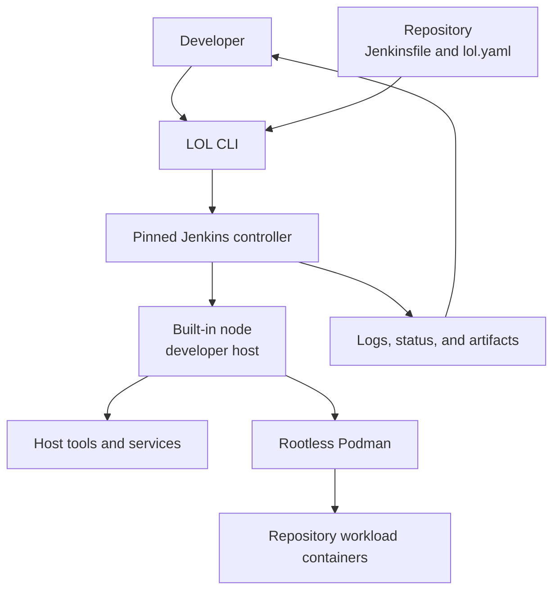
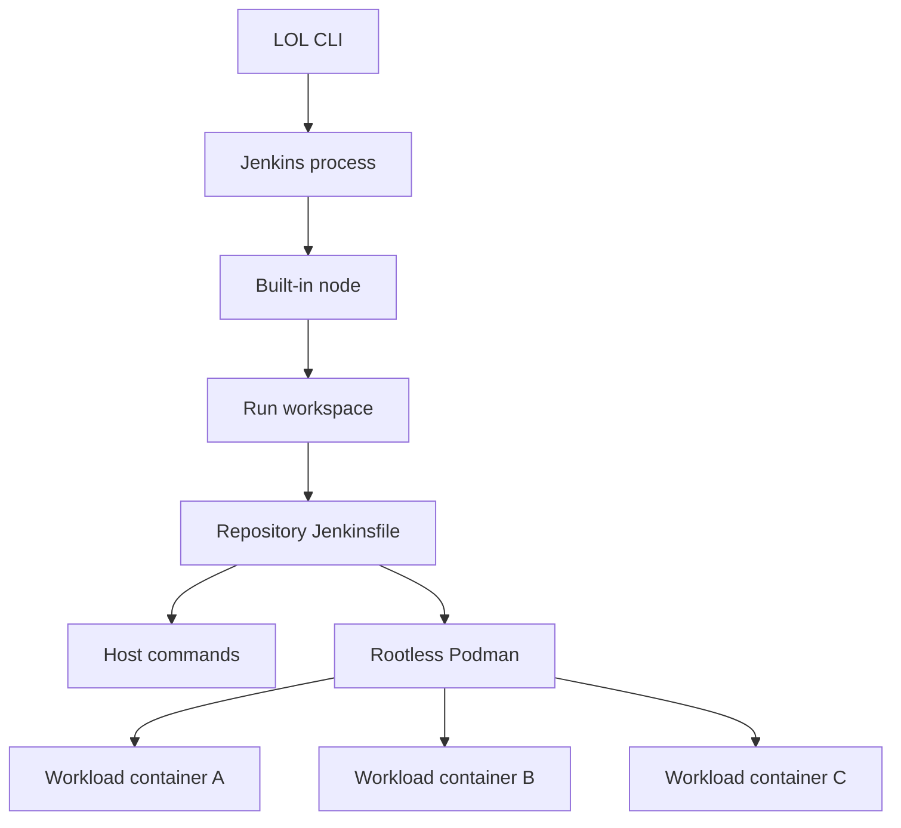
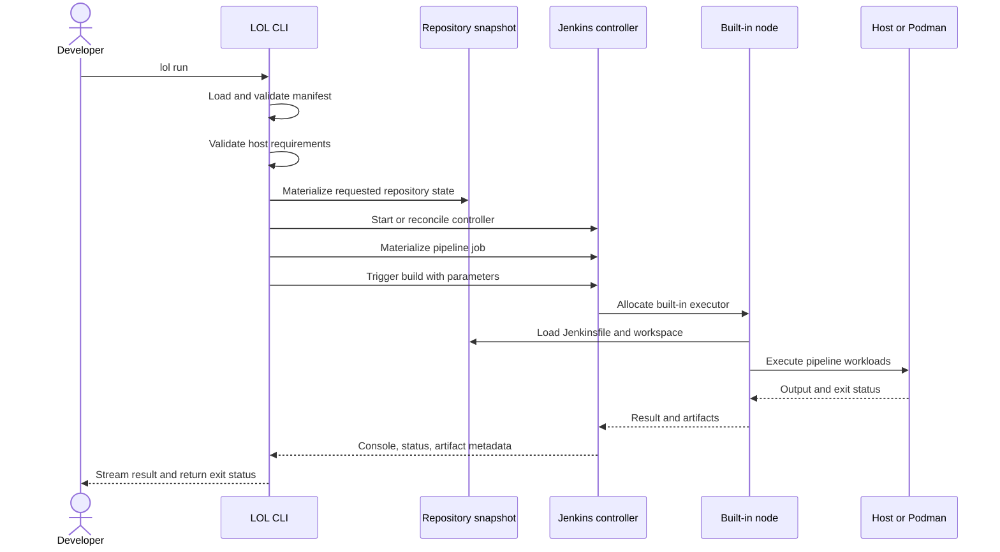
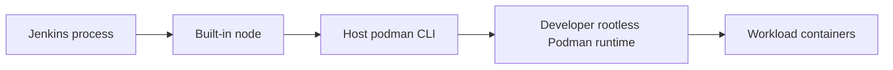
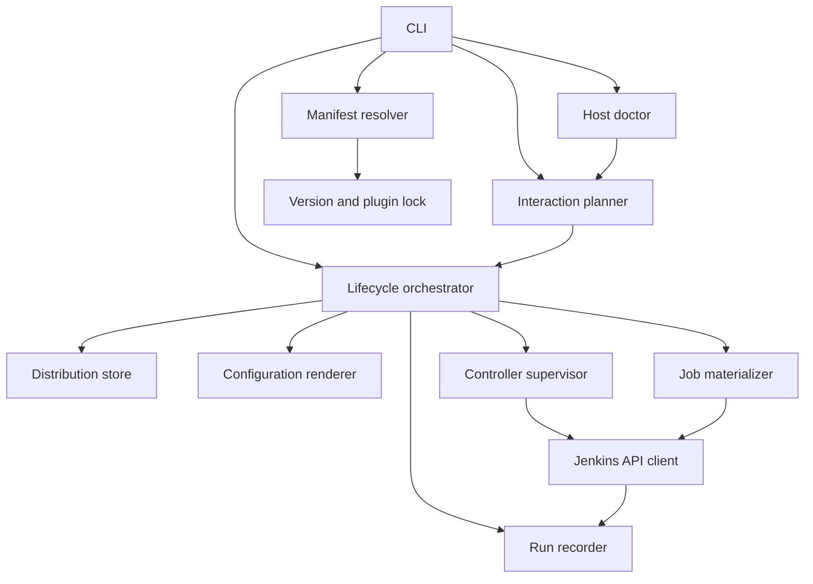

# LOL Architecture

## 1. Purpose

LOL, short for **Launch on Local**, is a reproducible local Jenkins harness. It allows a repository to execute its real Jenkinsfile on a developer workstation without depending on a shared Jenkins controller.

LOL is responsible for reproducing the Jenkins environment around the pipeline. The repository remains responsible for the pipeline and its workloads.

This document defines the initial architecture, repository contract, component boundaries, runtime lifecycle, security model, and planned extension points.

## 2. Status

This is the architecture baseline for LOL v1.

The following decisions are accepted:

- The Jenkins controller runs natively as the current developer user.
- The controller's built-in node executes pipelines.
- No Jenkins agent connection is required in v1.
- Jenkins state is isolated per project.
- Jenkins, plugins, and generated configuration are pinned and reproducible.
- Repository workloads run directly on the developer host or in containers launched by the Jenkinsfile.
- Rootless Podman is a repository capability, not the LOL infrastructure runtime.
- Interactive commands discover safe facts, prompt for material choices, and preview consequential actions.
- Every interactive workflow has an equivalent deterministic noninteractive mode.
- Separate agents, remote hosts, and Kubernetes are future backends.

## 3. Goals

LOL v1 must:

1. Run a repository's existing Jenkinsfile locally.
2. Reproduce the Jenkins version, required plugins, node labels, and controller configuration.
3. Execute the pipeline in an environment aligned with the developer's host.
4. Support Jenkinsfiles that launch multiple rootless Podman containers in parallel.
5. Avoid requiring a persistent system-wide Jenkins installation.
6. Isolate generated Jenkins state from both the repository and other LOL projects.
7. Provide deterministic startup, execution, logging, shutdown, and reset behavior.
8. Preserve a configuration contract that future execution backends can reuse.
9. Guide developers through environment diagnosis and safe, scoped repairs.
10. Remain scriptable in CI and other noninteractive environments.

## 4. Non-goals for v1

LOL v1 will not:

- Reproduce a host with a different operating system or CPU architecture.
- Provide dedicated hardware, devices, kernel modules, or specialized drivers.
- Orchestrate Jenkins agents across several machines.
- Run the Jenkins controller or built-in node in a container.
- Translate Podman workloads into Kubernetes objects.
- Rewrite Jenkinsfiles to make them locally compatible.
- Emulate external services that the pipeline requires.
- Provide production-grade multi-user Jenkins hosting.
- Guarantee compatibility with plugins that require an external controller integration.

These cases may be supported later through explicit backends or adapters.

## 5. Architectural principles

### 5.1 Preserve the Jenkinsfile

The Jenkinsfile is the workload contract. LOL should configure the environment around it rather than maintain a second local pipeline definition.

### 5.2 Keep infrastructure and workloads separate

LOL owns the controller, plugins, configuration, job, and run lifecycle. The repository owns its build images, test images, Containerfiles, parallelism, scripts, and artifacts.

### 5.3 Prefer host alignment in v1

The built-in node runs as the current developer user. Host commands, filesystem behavior, CPU architecture, rootless Podman configuration, and locally available resources therefore resemble the environment in which the developer is diagnosing the pipeline.

### 5.4 Pin reproducible inputs

A Jenkins version, plugin set, configuration schema, and LOL manifest version must resolve to the same controller inputs for every developer.

### 5.5 Make generated state disposable

Users must be able to destroy all generated controller state and recreate it from committed configuration.

### 5.6 Keep future execution backends replaceable

The repository contract must describe required capabilities and labels without assuming that the executor is always the built-in node.

## 6. System context



## 7. Responsibility boundaries

### 7.1 LOL owns

- Manifest parsing and validation
- Project identity and state paths
- Host prerequisite checks
- Jenkins distribution download and verification
- Plugin resolution and installation
- Plugin lock generation and enforcement
- Jenkins Configuration as Code rendering
- Controller process supervision
- Local authentication material
- Built-in node executors and labels
- Pipeline job materialization
- Repository snapshot selection
- Build triggering and parameter submission
- Console streaming
- Result and artifact discovery
- Shutdown, cleanup, and reset

### 7.2 Repository owns

- Jenkinsfile behavior
- Containerfiles and images
- Build and test scripts
- Workload parallelism
- Pipeline parameters and defaults
- Required host commands
- Required Podman networks, volumes, and images
- External service dependencies
- Artifact contents
- Cleanup performed inside the pipeline

### 7.3 Developer owns

- Host operating system and architecture
- Installation of required host-level runtimes
- Access to private source and container registries
- Credentials explicitly supplied to a run
- Adequate local compute and storage

## 8. Runtime topology

### 8.1 Accepted v1 topology



The Jenkins process and pipeline steps run with the same user identity that invoked LOL. This intentionally avoids:

- A separate `jenkins` operating-system account
- A system-wide Jenkins service
- A controller container
- A Jenkins agent container
- A mounted Podman service socket
- Podman-in-Podman
- Host/container workspace path translation

### 8.2 Executor behavior

The built-in node is enabled for the project controller. The default is one Jenkins executor.

One executor limits the controller to one pipeline build at a time but does not prevent the Jenkinsfile from running parallel branches or several workload containers concurrently.

Repositories may increase the executor count explicitly when they are safe to run concurrently:

```yaml
node:
  executors: 2
```

### 8.3 Node labels

LOL always assigns `lol-local` and may add host-derived informational labels. Repositories declare compatibility labels required by their Jenkinsfile:

```yaml
node:
  labels:
    - lol-local
    - linux
    - firmware-builder
```

LOL does not silently infer arbitrary upstream labels. A missing requested label must fail during preflight with a useful diagnostic rather than leave a build queued indefinitely.

## 9. Repository contract

### 9.1 Required files

```text
repository/
├── Jenkinsfile
└── lol.yaml
```

The Jenkinsfile may live elsewhere when configured with `pipeline.file`.

### 9.2 Initial manifest

```yaml
version: 1

jenkins:
  version: "pinned-lts"
  plugins:
    - workflow-aggregator
    - configuration-as-code

pipeline:
  file: Jenkinsfile
  parameters: {}

node:
  executors: 1
  labels:
    - lol-local
    - linux

requirements:
  commands:
    - git
  podman: false

environment:
  pass:
    - HTTP_PROXY
  set: {}

artifacts:
  patterns: []
```

### 9.3 Manifest rules

- `version` selects the LOL manifest schema.
- `jenkins.version` must resolve to an exact version before controller startup.
- `jenkins.plugins` is human-maintained input; LOL resolves it into an exact plugin lock.
- `pipeline.file` is relative to the repository root.
- `node.executors` defaults to `1`.
- `node.labels` declares labels advertised by the built-in node.
- `requirements.commands` lists commands that must be available to pipeline steps.
- `requirements.podman` requests rootless Podman validation.
- `environment.pass` explicitly permits selected host environment variables to enter the controller.
- `environment.set` defines non-secret environment values.
- Secrets must never be stored directly in `lol.yaml`.

### 9.4 Plugin lock

The committed plugin request and the exact resolved plugin graph serve different purposes.

```text
lol.yaml                 Human-maintained plugin requirements
lol.plugins.lock.yaml    Exact plugin and dependency versions
```

`lol lock` resolves and writes the lock. `lol up` uses the lock and fails when the manifest and lock disagree.

## 10. CLI contract

### 10.0 Interaction principles

LOL is interactive when human judgment is useful and deterministic when commands are scripted.

- Prompts are enabled only when standard input and output are attached to a terminal.
- Explicit command-line values take precedence over interactive choices.
- `--non-interactive` disables every prompt and fails with structured diagnostics when required input is missing.
- `--yes` accepts safe LOL-owned actions but never supplies secrets or silently authorizes privileged host changes.
- Repository mutations are previewed as diffs before confirmation.
- Destructive actions identify their exact targets and scope.
- A single obvious read-only target is selected automatically.
- Ambiguous targets are presented as numbered choices.
- Interactive workflows provide a final summary before writing, running, or deleting.
- Once a pipeline begins, LOL does not pause it for new interactive input.

### 10.1 Repository setup

```bash
lol init
lol lock
lol doctor
```

`init` performs discovery before prompting. It automatically resolves repository identity, platform, available tools, a safe project identity, standard labels, one executor, and the recommended Jenkins LTS. It prompts for choices such as multiple Jenkinsfiles, an alternate Jenkins version, detected pipeline labels, Podman requirements, and additional host commands.

Before writing, `init` previews `lol.yaml` and `lol.plugins.lock.yaml`. Existing configuration is never overwritten without explicit confirmation or `--force`.

`lol init --yes` accepts recommended values. `lol init --non-interactive` requires flags or configuration for every ambiguous choice and fails instead of guessing.

`lock` refreshes exact Jenkins plugin inputs after requirements change. When replacing an existing lock, it previews plugin additions, removals, upgrades, downgrades, and Jenkins compatibility changes before writing. A check-only mode reports drift without changing the lock.

`doctor` analyzes the effective configuration and host, recommends actions, and may coordinate safe repairs as defined in Section 10.5.

### 10.2 Controller lifecycle

```bash
lol up
lol status
lol open
lol down
lol reset
```

- `up` converges the local controller to the committed contract.
- `up` is normally noninteractive; it prompts only for migrations, required resets, incompatible plugin changes, or unresolved port/process conflicts.
- `down` stops it without deleting persistent generated state.
- `down` prompts when a pipeline is active and otherwise stops immediately.
- `reset` previews the exact generated state to be removed, confirms the scope, stops the controller, removes generated state, and recreates it from configuration.

### 10.3 Pipeline lifecycle

```bash
lol run
lol run --revision origin/main
lol run --jenkinsfile ci/Jenkinsfile
lol run --parameter KEY=value
lol logs --follow
lol stop
```

`lol run` starts the controller automatically when it is not already running. Before the build begins, it prompts for required parameters not supplied through flags, credential selection or secure temporary credential entry, and first-run trust confirmation for an untrusted repository.

Secrets are accepted only through secure input or a credential provider. They must not appear in shell arguments, generated configuration, preview output, run metadata, or normal logs.

`lol stop` selects a run when several are active and confirms cancellation. An explicit run ID removes selection ambiguity but does not remove confirmation unless `--yes` is supplied.

### 10.4 Exit status

`lol run` returns:

- `0` when the Jenkins build succeeds.
- A nonzero pipeline status when Jenkins completes with failure, instability configured as failure, abort, or timeout.
- A distinct nonzero harness status when LOL cannot provision or communicate with Jenkins.

Exact numeric codes belong in the CLI reference once implementation begins.

### 10.5 Diagnostic and repair model

Doctor separates analysis from mutation. Every diagnostic produces:

- Check identifier
- Status: pass, recommendation, warning, blocker, or unsupported
- Evidence suitable for verbose output
- Human-readable recommendation
- Zero or more typed repair actions
- Revalidation checks affected by each repair

Repair actions belong to one of these scopes:

| Scope | Examples | Doctor behavior |
| --- | --- | --- |
| LOL-owned | Download Jenkins, generate a lock, repair cached metadata | Offer to apply directly |
| Repository-owned | Add a node label or declared requirement | Show a diff and request confirmation |
| User environment | Select Java or initialize rootless Podman | Explain and offer safe user-level actions |
| Privileged host | Install packages or change operating-system configuration | Require explicit confirmation; never covered by ordinary `--yes` |
| Manual | Supply credentials or restore an unavailable service | Provide instructions without claiming resolution |

Doctor modes are:

```bash
lol doctor                 # Analyze, prompt for repairs, and revalidate
lol doctor --check         # Read-only analysis for CI or scripts
lol doctor --fix           # Prompt only for discovered repairs
lol doctor --fix --yes     # Apply safe LOL-owned repairs
lol doctor --verbose       # Include diagnostic evidence
```

After an accepted action, doctor reruns every affected check and reports the new state. Its final state is one of:

- Ready
- Ready with recommendations
- Blocked
- Unsupported

`--check` returns a stable nonzero exit status for blockers and unsupported requirements.

### 10.6 Other interactive commands

| Command | Interactive behavior |
| --- | --- |
| `lol config edit` | Reuse the `init` discovery and guided configuration model |
| `lol artifacts` | Select a run or artifact only when the target is ambiguous |
| `lol clean` or `lol prune` | Select stale state and confirm exact deletion targets |
| `lol upgrade` | Preview Jenkins, plugin, schema, and migration changes |
| `lol credentials add` | Securely request provider, name, value, and allowed scope |

Read-only commands such as `status`, `logs`, `runs`, `config show`, and fully targeted artifact queries do not normally prompt.

## 11. Run lifecycle



## 12. Repository state and workspaces

### 12.1 Required behavior

Local pipeline testing must be able to exercise current development changes, not only a previously pushed branch. Each run therefore operates on an immutable, run-scoped repository snapshot.

The default snapshot includes:

- The selected Git revision
- Tracked working-tree modifications
- Untracked files that are not ignored

Ignored files and LOL-generated state are excluded. A clean committed run is available through `--revision`.

### 12.2 Jenkins SCM compatibility

The snapshot must be presented to Jenkins as an SCM source so common Jenkins behavior such as `checkout scm`, changelog generation, and repository-relative loading continues to work.

The exact local SCM transport requires an implementation spike. Acceptable implementations must:

- Avoid modifying the user's branch or index
- Avoid creating user-visible commits
- Preserve executable bits and symlinks
- Prevent Jenkins from reading outside the snapshot
- Work without external network access
- Provide a stable SCM identity for the duration of the run

This decision will be recorded as an architecture decision record before implementation is considered complete.

### 12.3 State locations

LOL follows XDG locations by default:

```text
${XDG_STATE_HOME:-~/.local/state}/lol/<project-id>/
├── controller/
│   └── jenkins-home/
├── runs/
│   └── <run-id>/
│       ├── metadata.json
│       ├── console.log
│       └── artifacts/
└── runtime/
    ├── controller.pid
    ├── controller.log
    └── endpoint.json

${XDG_CACHE_HOME:-~/.cache}/lol/
├── jenkins/
├── plugins/
└── downloads/
```

`project-id` is derived from the repository's canonical path plus stable repository identity. Moving a repository may intentionally create a new local environment unless the manifest supplies an explicit project ID.

## 13. Controller provisioning

### 13.1 Distribution

LOL downloads a pinned Jenkins WAR into the shared cache and verifies its digest before execution. The repository does not vendor the WAR.

### 13.2 Java

LOL discovers a compatible Java runtime and reports the selected executable and version through `lol doctor`. LOL v1 does not install or mutate system Java.

### 13.3 Plugins

Plugins are downloaded and installed before Jenkins starts. Startup must never depend on selecting plugins through the setup wizard.

The plugin lock records:

- Requested plugins
- Transitive plugin dependencies
- Exact versions
- Artifact digests when available
- Jenkins core version used during resolution

### 13.4 Configuration as Code

LOL generates Jenkins Configuration as Code from the manifest and internal defaults. Generated configuration includes:

- Local security realm
- Loopback-only controller URL
- Built-in node executor count
- Built-in node labels
- Quiet period and run defaults
- Disabled setup wizard
- Project environment variables
- Tool-specific configuration owned by LOL

Generated files are not committed. The manifest and lock are the source of truth.

### 13.5 Job materialization

LOL creates one Pipeline job per project by default. The job points at the run-scoped repository snapshot and configured Jenkinsfile path.

Job creation must be idempotent. `lol up` reconciles generated job configuration while preserving build history unless reset was requested.

The initial implementation should use a supported Jenkins API rather than directly mutating files under `JENKINS_HOME` while Jenkins is running.

## 14. Controller supervision

LOL starts Jenkins as a child or supervised user process with:

- An explicit Java executable
- An explicit WAR path
- An isolated `JENKINS_HOME`
- A loopback bind address
- A project-specific available port
- Generated configuration paths
- A sanitized environment
- Controller logs redirected into project state

The supervisor records sufficient metadata to determine whether the process is current, stale, or owned by another LOL invocation.

LOL must not kill a process based only on a reused process ID. Process identity validation must include the recorded start time or another platform-supported identity.

## 15. Networking

- Jenkins binds to `127.0.0.1` by default.
- LOL chooses an available port and persists it for the project.
- `lol open` reads the recorded endpoint rather than assuming port 8080.
- Remote access is outside v1 scope.
- Pipeline workloads retain the developer host's normal network behavior.
- Podman workload networking remains repository-owned.

## 16. Podman integration

### 16.1 Role in v1

Podman does not run LOL infrastructure. It is an optional workload runtime invoked by the Jenkinsfile.



### 16.2 Validation

When `requirements.podman` is true, `lol doctor` verifies:

- The Podman CLI is available
- Podman is operating rootlessly
- The runtime is responsive
- Required storage is writable
- Any explicitly declared network or image prerequisite is available or can be created by the repository

LOL reports failures but does not silently reconfigure the developer's Podman environment.

### 16.3 Run metadata

LOL exposes non-secret metadata to the pipeline:

```text
LOL_PROJECT_ID
LOL_RUN_ID
LOL_CONTROLLER_URL
LOL_WORKSPACE
```

Repositories may use `LOL_PROJECT_ID` and `LOL_RUN_ID` as Podman labels or name prefixes. LOL does not intercept or rewrite arbitrary `podman` commands.

### 16.4 Cleanup

LOL only removes containers, networks, or volumes that can be proven to belong to the current LOL project and run. Unlabeled repository-created resources are reported but not deleted automatically.

## 17. Configuration precedence

Effective configuration is resolved in this order, from lowest to highest precedence:

1. LOL built-in defaults
2. Committed `lol.yaml`
3. User-level LOL configuration
4. Explicit CLI flags

Secret values are resolved separately and are never written into effective configuration output.

`lol config show` prints the resolved non-secret configuration and the source of each value.

## 18. Security model

LOL is a local single-user development tool, but Jenkinsfiles and build dependencies execute code with the invoking user's privileges.

### 18.1 Controller security

- Bind Jenkins to loopback only.
- Disable the interactive setup wizard.
- Generate per-project local credentials.
- Store credentials with user-only filesystem permissions.
- Keep CSRF protection enabled.
- Avoid printing credentials in normal command output.
- Use authenticated supported APIs for job and build operations.

### 18.2 Pipeline trust

Running `lol run` is equivalent to running repository scripts locally. A Jenkinsfile can read files available to the developer and invoke host commands.

LOL must warn before running an untrusted repository for the first time. Strong sandboxing is not a v1 guarantee.

Trust confirmation is stored against repository identity and invalidated when LOL cannot prove that the current repository is the previously trusted source. `--yes` does not bypass first-run trust for an untrusted repository unless a separate explicit trust flag is provided.

### 18.3 Environment filtering

LOL starts Jenkins with a minimal environment. Host environment variables enter the controller only when required internally or explicitly allowed through configuration.

Known secret-shaped variables must be redacted from diagnostics and effective configuration output.

### 18.4 Repair authorization

Doctor and other interactive commands must classify actions before offering them. Project-scoped and LOL-cache changes may be approved normally. Repository changes require a visible diff. Privileged actions require a separate explicit confirmation and must display the command or operation to be performed.

Noninteractive execution never elevates privileges or waits for an authentication prompt.

## 19. Concurrency

- One controller instance is allowed per project state directory.
- One Jenkins executor is the default.
- One `lol run` command owns a run record, even when the pipeline has many parallel branches.
- Multiple repositories may run separate LOL controllers concurrently.
- Port allocation and state locks prevent collisions.
- Concurrent builds within one project require an explicit executor increase.

## 20. Failure and recovery

### 20.1 Provisioning failure

LOL retains controller logs and reports the failed lifecycle phase. A later `lol up` retries convergence from the last validated state.

### 20.2 Pipeline failure

Pipeline failure does not destroy the controller or run record. Console output and discovered artifacts remain available.

### 20.3 Stale controller metadata

If the recorded controller process is gone, LOL marks the instance stopped and safely removes stale runtime metadata.

### 20.4 Configuration drift

LOL computes a digest from the effective manifest, Jenkins version, plugin lock, and generated configuration. When the digest changes, `lol up` reports whether a restart or reset is required.

### 20.5 Reset

`lol reset` is explicitly destructive to generated project state. It must display the exact project state directory and require confirmation unless `--yes` is supplied.

Repository source files and shared caches are never reset.

### 20.6 Interactive failure

When a prompt cannot be displayed, LOL must not choose a risky default. It returns a structured error listing the missing decisions and the flags or configuration keys that can satisfy them.

## 21. Observability

Every run receives a unique run ID and records:

- Project identity
- Repository snapshot identity
- Jenkins version
- Plugin lock digest
- Effective configuration digest
- Jenkins build number and URL
- Start and finish timestamps
- Final result
- Console-log path
- Discovered artifacts

Primary commands:

```bash
lol status
lol logs [--run <id>] [--follow]
lol runs
lol artifacts [--run <id>]
lol doctor --verbose
```

## 22. Internal component model



### 22.1 CLI

Parses commands, renders user-facing output, and translates domain errors into stable exit statuses.

### 22.2 Manifest resolver

Loads schemas, merges configuration layers, validates paths, and produces an immutable effective configuration.

### 22.3 Host doctor

Checks Java, Git, Podman, filesystem permissions, ports, and declared host commands without mutating the host.

It produces typed findings and repair actions. Analysis remains read-only until the interaction planner authorizes an action.

### 22.4 Interaction planner

Determines whether prompting is allowed, resolves supplied flags, presents choices and diffs, records confirmations, enforces action-scope policy, and returns explicit decisions to the lifecycle orchestrator.

### 22.5 Distribution store

Downloads, verifies, caches, and locates Jenkins and plugin artifacts.

### 22.6 Configuration renderer

Produces Jenkins Configuration as Code and runtime environment files from typed configuration.

### 22.7 Controller supervisor

Starts, observes, and stops the Jenkins process. It owns runtime locks and process identity validation.

### 22.8 Jenkins API client

Waits for readiness, manages authentication and crumbs, creates jobs, triggers builds, streams console output, and reads results.

### 22.9 Job materializer

Creates the run-scoped SCM source and reconciles the generated Pipeline job.

### 22.10 Run recorder

Persists run metadata, console output, results, and artifact indexes independently of controller availability.

## 23. Proposed repository layout

The implementation language remains an explicit project decision. The repository should preserve these conceptual boundaries:

```text
lol/
├── README.md
├── docs/
│   ├── architecture.md
│   ├── cli.md
│   └── decisions/
├── schemas/
│   ├── lol-v1.schema.json
│   └── plugin-lock-v1.schema.json
├── examples/
│   ├── basic/
│   └── podman-parallel/
├── src/
│   ├── cli/
│   ├── config/
│   ├── doctor/
│   ├── distribution/
│   ├── jenkins/
│   ├── project/
│   └── runs/
└── tests/
    ├── unit/
    ├── integration/
    └── fixtures/
```

Language-specific conventions may rename `src` and test directories without changing the component boundaries.

## 24. Testing strategy

### 24.1 Unit tests

- Manifest parsing and precedence
- Schema validation
- Project identity
- State-path resolution
- Port allocation
- Process identity checks
- Configuration rendering
- Secret redaction
- Result and exit-status mapping
- TTY and noninteractive mode selection
- Confirmation and action-scope policy
- Diff preview and secret redaction

### 24.2 Integration tests

- Download and start a pinned Jenkins controller
- Install a pinned plugin set
- Apply generated configuration
- Create and run a Pipeline job
- Stream console output
- Run parallel shell stages
- Run parallel rootless Podman workloads when available
- Stop and restart while preserving state
- Reset and recreate deterministic configuration
- Diagnose and repair a fixable environment issue
- Refuse ambiguous input in noninteractive mode
- Prevent `--yes` from approving privileged or secret-bearing actions

### 24.3 Compatibility fixtures

- `agent any`
- Explicit built-in node label
- Declarative Pipeline
- Scripted Pipeline
- Pipeline parameters
- `checkout scm`
- Parallel stages
- Archived artifacts
- Failed, aborted, unstable, and timed-out builds

## 25. Future backends

### 25.1 Containerized agent

A Podman agent backend will connect a repository-specific Jenkins agent to the controller. It will be appropriate when the pipeline's execution environment must be isolated or reproduced independently from the host.

### 25.2 Remote static agents

A remote backend will register agents on fixed hosts and map declared capabilities to Jenkins labels. Jenkins will continue to own node selection.

### 25.3 Kubernetes

A Kubernetes backend may create ephemeral Jenkins agent pods and represent workloads as pods or jobs. It becomes useful when dynamic scheduling, replacement, isolation, and multi-node capacity management outweigh cluster complexity.

### 25.4 Backend-neutral contract

Future manifests may replace the v1 `node` section with named execution profiles while retaining compatibility:

```yaml
execution:
  profile: local
  requires:
    os: linux
    architecture: x86_64
    labels:
      - firmware-builder
```

The local profile maps these requirements to the built-in node. Future profiles may map them to Podman agents, remote hosts, virtual machines, or Kubernetes pods.

## 26. Open architecture decisions

The following require focused implementation spikes or explicit decisions:

1. Implementation language and packaging format
2. Local SCM snapshot transport used by Pipeline from SCM
3. Jenkins job materialization API
4. Plugin resolver and lock-file implementation
5. Supported Jenkins core range and upgrade policy
6. Artifact download versus index-only behavior
7. Credential providers and secret-injection interface
8. Windows and macOS support strategy
9. Behavior for Git submodules and large-file storage
10. Stable numeric CLI exit codes
11. Privileged repair execution policy by supported operating system
12. Credential-provider interface and temporary-secret lifetime

These decisions should be recorded under `docs/decisions/` as architecture decision records.

## 27. Definition of the v1 architecture milestone

The architecture is realized when a developer can enter a repository containing `Jenkinsfile` and `lol.yaml`, run:

```bash
lol doctor
lol run
```

and receive the same Jenkins result, logs, and artifacts from a disposable pinned local controller, including when the Jenkinsfile launches several rootless Podman workload containers in parallel.
